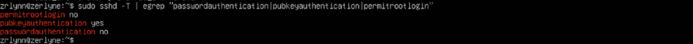
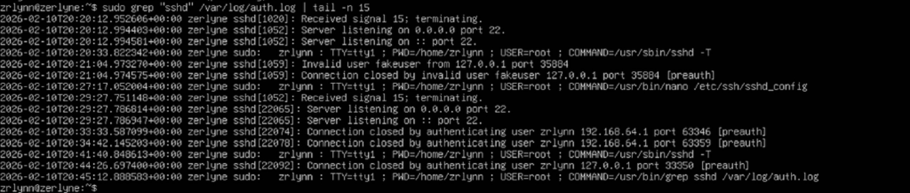

# Linux SSH Hardening and User Security

## Overview
This project focuses on hardening Secure Shell (SSH) access on a Linux system to reduce exposure to brute-force attacks and unauthorized access.
The goal was to apply industry-standard SSH security controls and validate their effectiveness through testing and log analysis.

## Tools Used
- UTM

## Objectives
- Reduce SSH attack surface
- Enforce secure authentication mechanisms
- Prevent unauthorized and high-risk access
- Validate security controls through testing and logs

## Security Controls Implemented

### SSH Hardening
- Disabled password-based SSH authentication
- Enforced SSH key-based authentication
- Disabled root SSH access
- Ensured proper SSH directory and key permissions
- Restarted and validated SSH daemon configuration

### User Security
- Verified user access restrictions
- Confirmed authentication behavior through controlled login attempts

## Validation and Testing

### SSH Configuration Verification
Validated SSH runtime settings using:
*sudo sshd -T | egrep "passwordauthentication|pubkeyauthentication|permitrootlogin"*

Confirmed:
- PasswordAuthentication no
- PubkeyAuthentication yes
- PermitRootLogin no

### Authentication Testing
Attempted password-based SSH login:
*ssh -o PreferredAuthentications=password localhost*

Result:
- Password authentication was rejected as expected

### Log Analysis
Reviewed authentication logs to confirm enforcement:
*sudo grep sshd /var/log/auth.log | tail -n 15*

Observed:
- Failed password-based login attempts
- Absence of successful password logins
- Evidence of enforced SSH security policies

## Screenshots
Screenshots included in this repository demonstrate:
- SSH configuration validation
- Rejected password authentication attempts
- Authentication log entries confirming enforcement

### SSH Hardening Configuration

### Rejected Password-Based Authentication

### Authentication Log Configuration

